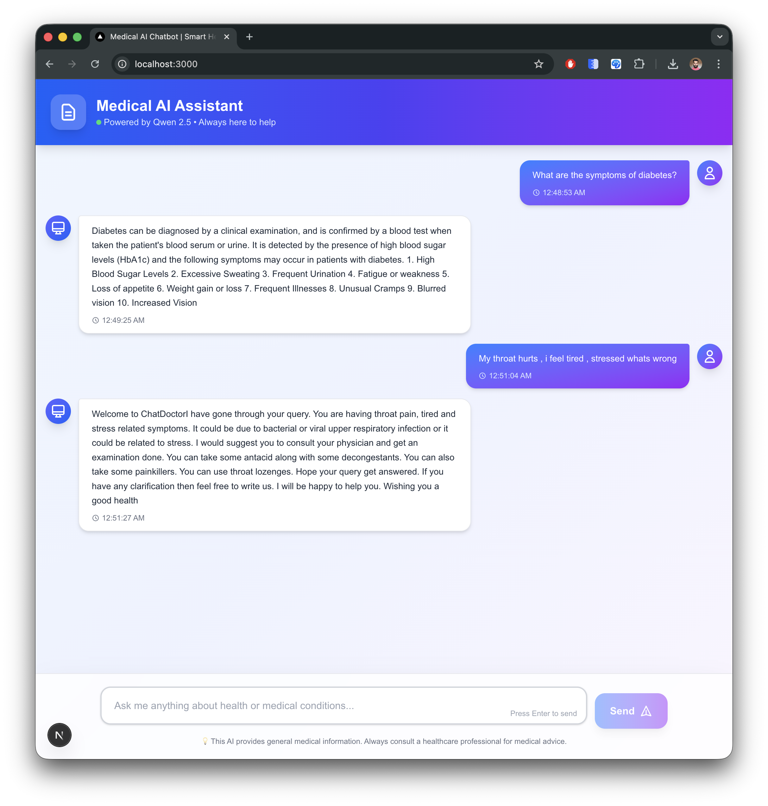
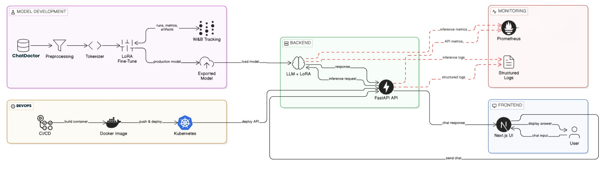
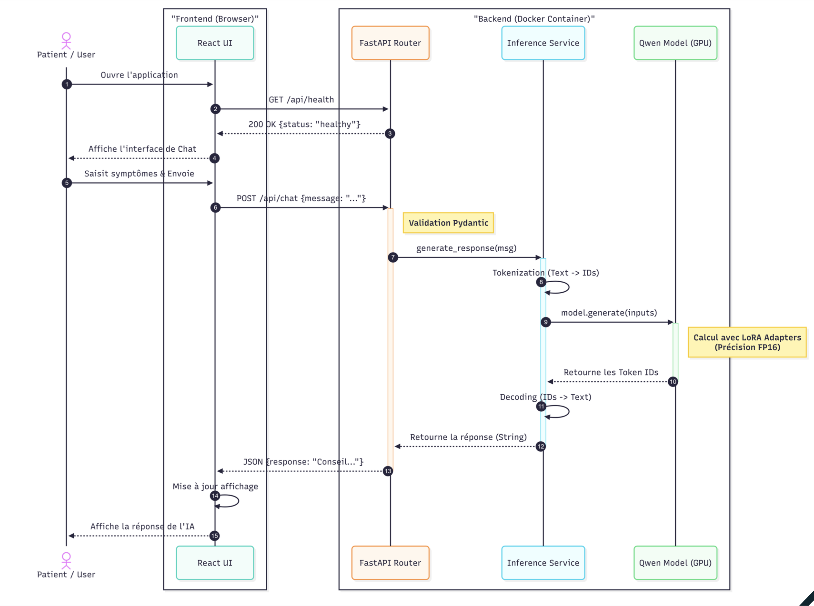
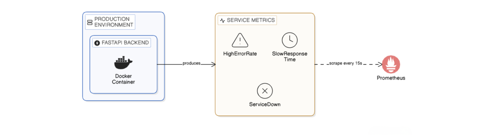
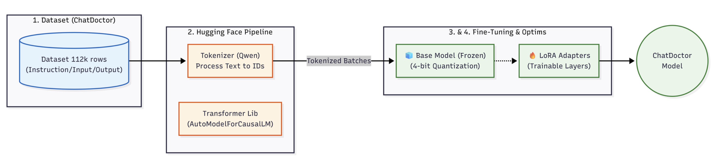
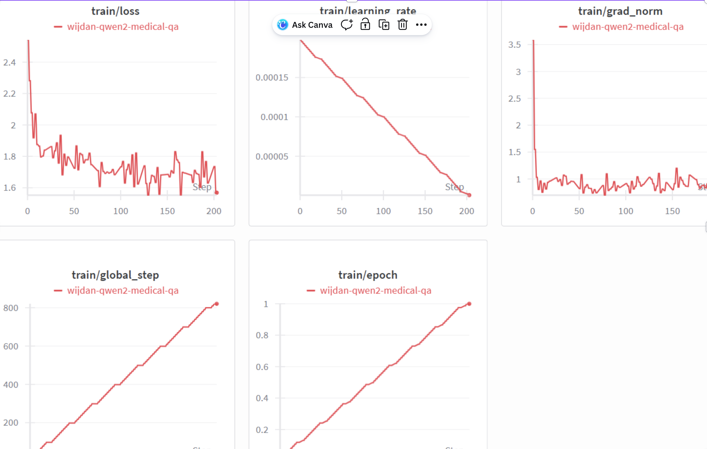
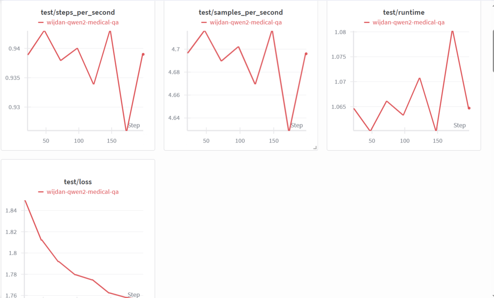
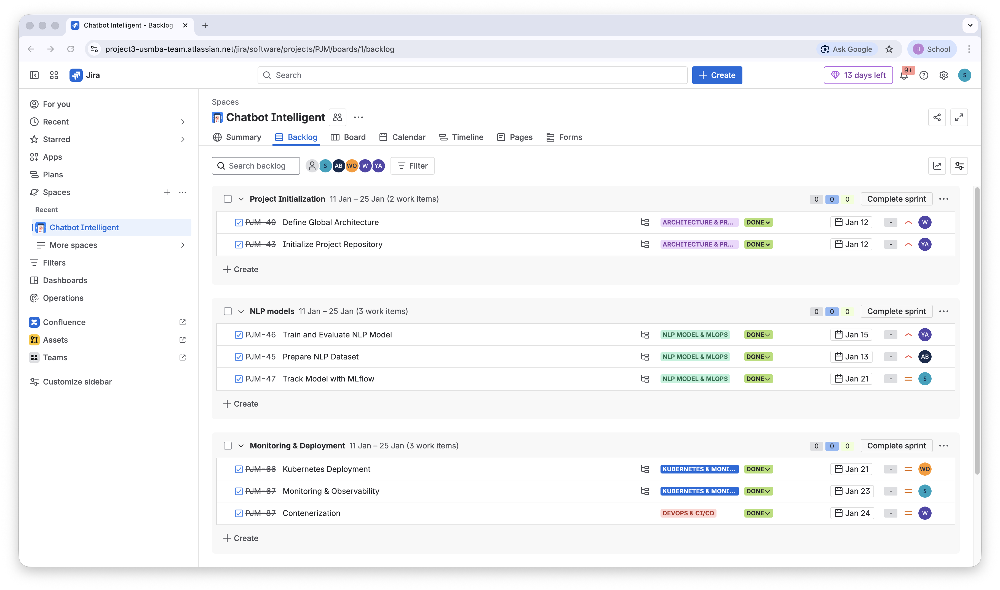

# 🧑🏻‍⚕️ Medical AI Chatbot Microservices System   

---

## Team Members

- Achehboune Youssef
- BAKKOURI Ayoub
- EL Karami Wijdane
- EL Idrissi Ayoub
- Wende Benedo Ariel Ouedraogo
- Sakkoum Hamza

**Supervisor:** TAHA TEHITAH

**Program:** Advanced Machine Learning & Multimedia Intelligence

---

## Project Overview

The **Intelligent Chatbot System** is an end-to-end AI application designed to demonstrate **modern DevOps and MLOps practices**.  
The system provides a conversational chatbot capable of understanding user intents and responding appropriately, while being fully automated, scalable, monitored, and continuously improvable.

This project follows the **Scrum methodology** and showcases:
- NLP model development
- Full-stack application (Frontend + Backend)
- CI/CD automation
- Kubernetes deployment
- Monitoring and observability
- Automated model retraining pipeline (MLOps)

---

## 🎨 Chatbot Interface

Our Medical AI Chatbot features a modern, intuitive, and user-friendly interface designed for optimal user experience:



*Modern chatbot interface with gradient design, smart avatars, and intuitive conversation flow*


---

## Architecture Overview

The system follows a modern microservices architecture with comprehensive DevOps and MLOps pipelines:

- **Frontend:** Next.js + React + Tailwind CSS
- **Backend:** FastAPI (Async) with inference service
- **NLP model :** Qwen 2.5 (0.5B) fine-tuned with LoRA on ChatDoctor dataset
- **Monitoring:** Prometheus for metrics collection
- **CI/CD:** GitHub Actions with Git Flow
- **Infrastructure:** Docker + Kubernetes (HPA, self-healing)
- **MLOps:** MLflow for model registry, W&B for experiment tracking



*Figure 1: Global system architecture showing the interaction between frontend, backend, ML model, and infrastructure components*



*Figure 2: Sequence diagram illustrating the request flow from user to AI response*

---


## DevOps Pipeline

### 1. Frontend (Next.js + Tailwind CSS)

- Modern React framework for responsive, performant UI
- Utility-first Tailwind CSS for rapid interface development
- Client-side and server-side rendering capabilities
- Seamless backend API integration

### 2. Backend (FastAPI)

Asynchronous API bridging frontend and NLP model:

- **Request Processing:** Message validation, error handling, and security
- **NLP Integration:** Inference via fine-tuned Qwen model with medical prompts
- **Quality Control:** Response parameters (temperature, length, repetition penalty)
- **API Standards:** CORS support, normalized JSON responses, optimized latency

### 3. Monitoring (Prometheus)

- **Time-Series Database (TSDB):** Collects metrics from FastAPI every 10 seconds
- **Real-time Tracking:** Live performance monitoring and anomaly detection
- **Alerting:** Automatic alert triggering on threshold violations



*Figure 3: Prometheus metrics dashboard showing real-time system performance*

### 4. Containerization & Orchestration

**Docker:**
- Environment standardization and reproducibility (Python/Node.js isolation)
- GPU integration via Nvidia Container Toolkit for CUDA acceleration
- Multi-service orchestration with Docker Compose

**Kubernetes:**
- High availability with self-healing (automatic pod restart)
- Horizontal Pod Autoscaling (HPA) based on CPU/GPU load
- Zero-downtime rolling updates for continuous deployment


## MLOps Pipeline

### 1. Dataset & Model Training

**ChatDoctor Dataset (112k samples):**
- Real patient-doctor conversation pairs
- Structure: Instruction (system prompt) + Input (patient query) + Output (expert response)
- Objective: Train empathetic, professional medical responses

**Training Framework:**
- Hugging Face Transformers for model and tokenizer loading
- Qwen 2.5 tokenizer with padding/truncation (max_length=512)
- Standardized input preprocessing

### 2. Model Optimization (LoRA)

**Low-Rank Adaptation (PEFT):**
- Inject small matrices (rank r=16 or r=32) into attention layers (q_proj, v_proj)
- Train only ~0.5% of total parameters
- Enable fine-tuning on single T4 GPU without performance loss



*Figure 4: LoRA fine-tuning process visualization*

### 3. Experiment Tracking (W&B + MLflow)

**Weights & Biases:**
- Real-time learning curve visualization (Training vs Validation Loss)
- GPU metrics monitoring (T4 consumption, temperature, VRAM)
- Collaborative experiment reports



*Figure 5: Weights & Biases training metrics and learning curves*



*Figure 6: Model evaluation and test performance metrics*

**MLflow:**
- Model versioning and registry
- Automated model comparison and promotion

---

## Technical Achievements

- **Cost-Efficient Fine-tuning:** Successfully deployed Small Language Model (Qwen 0.5B) using LoRA optimization (~0.5% parameters trained) on single T4 GPU
- **Production-Ready Infrastructure:** End-to-end automated pipeline (CI/CD, Docker, MLflow, Kubernetes) ensuring reliability and scalability
- **Low-Latency Inference:** Asynchronous FastAPI service with containerization and load balancing for optimal performance
- **Full Observability:** Prometheus metrics, structured logs, and W&B tracking for comprehensive system monitoring

---

## Project Management

- **Platform:** JIRA for sprint planning and task management
- **Methodology:** Agile/Scrum with iterative development
- **Collaboration:** Git Flow branching strategy with pull request reviews



*Figure 7: JIRA board showing sprint planning and task management*

---

## Project Structure
```text
intelligent-chatbot/
│
├── README.md
├── .gitignore
├── docker-compose.yml
│
├── backend/                      # Backend API (FastAPI)
│   |
│   |── main.py               # FastAPI entry point
│   |── routes/
│   │   ├── chat.py        # /chat endpoint
│   │   ├── health.py      # /health endpoint
|   |   |── __init__.py
│   ├── services/
│   │   ├── inference.py       # Model inference logic
│   │   ├── model_loader.py    # Load model from MLflow
│   │   └── __init__.py
│   │   ├── core/
│   │   │   ├── config.py          # Environment variables
│   │   │   └── logging.py
│   │   └── __init__.py
│   ├── tests/
│   │   ├── test_chat.py
│   │   └── test_health.py
│   ├── requirements.txt
│   └── Dockerfile
│
├── frontend/                     # Web-based Chat Interface
│   ├── public/
│   ├── src/
│   │   ├── components/
│   │   │   └── ChatUI.jsx
│   │   ├── services/
│   │   │   └── api.js             # Backend API calls
│   │   ├── App.jsx
│   │   └── main.jsx
│   ├── package.json
│   ├── vite.config.js
│   └── Dockerfile
│
├── ml/                           # Machine Learning & MLOps
│   ├── data/
│   │   ├── raw/
│   │   └── processed/
│   ├── training/
│   │   ├── train.py               # Initial training
│   │   ├── evaluate.py
│   │   └── preprocessing.py
│   ├── retraining/
│   │   ├── retrain.py             # Automated retraining
│   │   ├── compare_models.py      # New vs production model
│   │   └── promote_model.py       # MLflow model promotion
│   ├── mlflow/
│   │   └── mlflow_tracking.py
│   └── requirements.txt
│
├── cicd/                         # CI/CD Pipelines
│   ├── github-actions/
│   │   └── pipeline.yml
│   └── scripts/
│       ├── deploy.sh
│       └── rollback.sh
│
├── k8s/                          # Kubernetes Manifests
│   ├── backend-deployment.yaml
│   ├── frontend-deployment.yaml
│   ├── service.yaml
│   ├── ingress.yaml
│   └── hpa.yaml
│
├── monitoring/                   # Monitoring & Observability
│   ├── prometheus/
│   │   └── prometheus.yml
│   ├── grafana/
│   │   └── dashboards/

```

---

## Key Challenges & Solutions

#### Challenge 1: Fine-tuning Cost

- **Problem:** Limited GPU resources, high computational cost, long training time
- **Solution:** LoRA + optimized batch size → reduction in computation and memory footprint

#### Challenge 2: Model Deployment & Service

- **Problem:** High latency during inference due to large LLM size
- **Solution:** Asynchronous service with FastAPI + containerization + Kubernetes (K8s) for load balancing and resource optimization

#### Challenge 3: Observability & Debugging

- **Problem:** Lack of visibility on model performance and system behavior in production
- **Solution:** Prometheus for metrics + structured logs + Weights & Biases for experiment tracking and model registry

---

## Conclusion

The Medical AI Chatbot project successfully demonstrates the integration of advanced machine learning techniques with robust DevOps and MLOps practices. The solution provides a scalable, monitored, and production-ready medical AI assistant while maintaining cost efficiency through innovative optimization strategies like LoRA and containerization.

---
